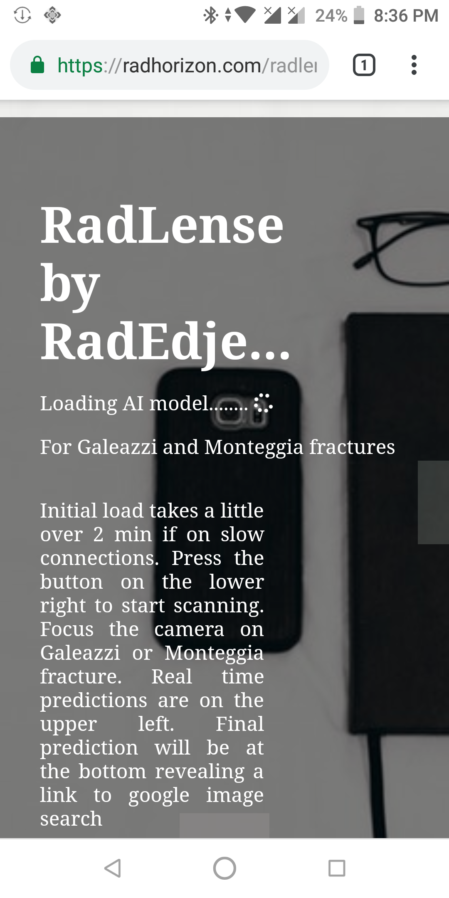
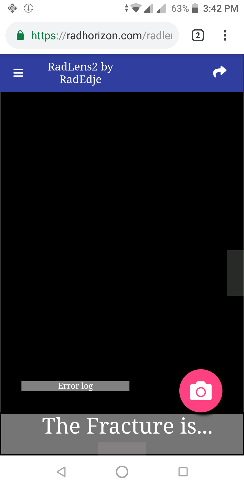
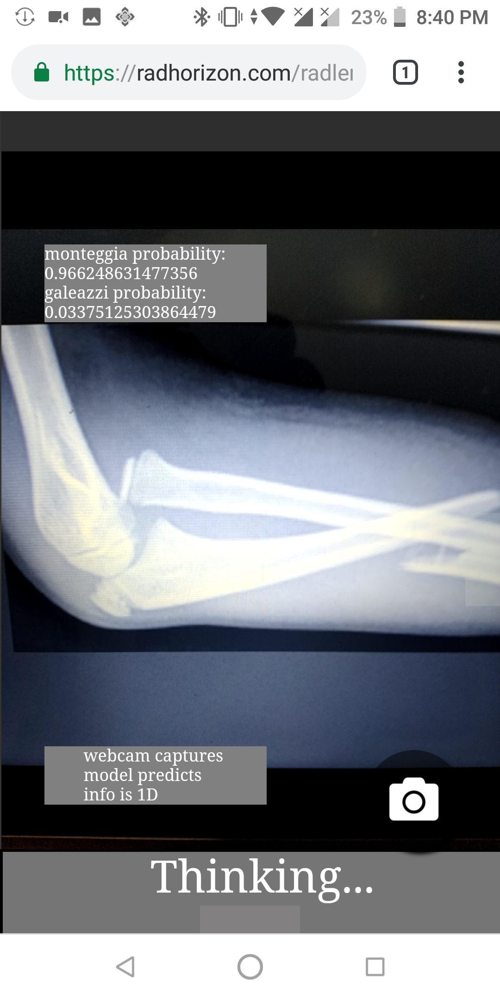
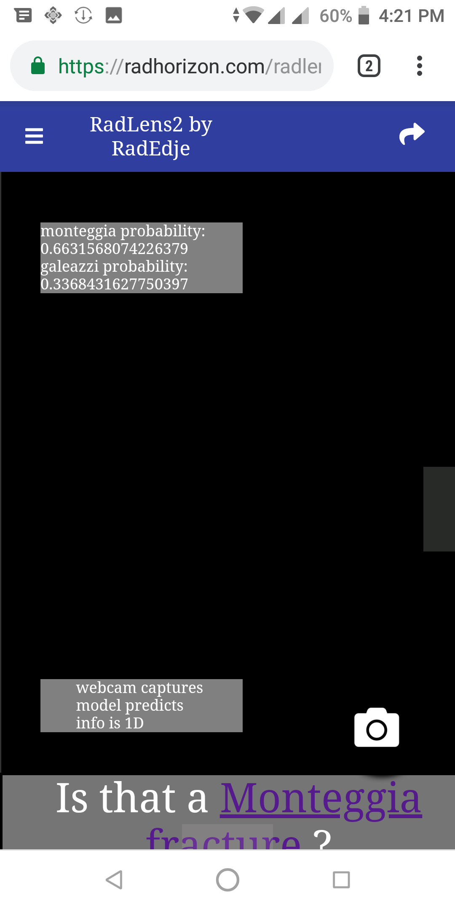
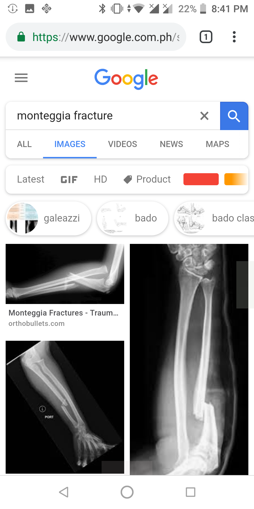

# RadLens2 powered by Tensorflow 2.0

### This is the fully migrated version of my inital RadLens web app now using Tensorflow 2.0 (python) and Tensorflow.js ver 1.0.0

RadLens2 (just like the initial RadLens) is a web app that 
tries to classify images as either a Monteggia or Galeazzi fracture (fractures of the forearm). It uses an AI/ML algorithm that runs right in the browser on the local machine (phones running android 8.0 or iOS devices running safari 11; latest chrome, firefox, opera on laptop and desktop). It uses the phone's/laptop's/desktop's camera to scan images.

## Differences from the original Radlens:
  * now uses the native tf.keras api (instead of keras itself).
  * smaller AI/ML model foot print after conversion from native tf python to tf js
  * results in faster initial load times (10-30 seconds on some moderate internet connection speeds versus the older web app which used to take 1-2 mins for the initial load time
  * currently running on the latest nightly build of tensorflow 2.0(tf-nightly-2.0-preview)


## HOW TO USE THE WEB APP  
  1. Opening the app leads you to a splash screen while the AI/ML Model loads in the background. Initial loading time used to take 1-2 minutes but using the new tensorflow 2.0 has vastly sped up the loading time now down to 10-30 seconds. This will then take you to the main app screen. 
  <br>
  
  
  <br>
  2. PRESS the pink floating action button with a `Camera` icon at the right lower corner of the main app screen to start scanning with your device's camera.  
  3. Point the camera at either a Monteggia or Gleazzi fracture.
  <br>
  )
  <br>
  4. The camera will continuously make predictions based on the live feed of images taken from the camera.
  5. You can start zooming in and out or even tilting the camera if you want to add more image data as the AI/ML algorithm runs
  6. After a sufficiant sample has been aquired and conditions are met, the AI/ML algorithm of Radlens2 will make a prediction at the buttom.
  <br>
  )
  <br>
  7. This prediction will be a hyperlink. You can either click or tap on this hyperlink to take you to a google image search of either monteggia fractures or galeazzi fractures.
  <br>
  )
  <br>

# 
# RE-TRAINING THE WEB APP

## VIRTUAL ENVIRONMENT
It's always best to create a virtual python environment. Once you have one, cd into it and proceed.

## DEPENDENCIES

### Python dependencies
```
pip install tf-nightly-2.0-preview
pip install h5py pandas pillow scipy
pip install tensorflowjs
```


## TRAINING

1. cd into the RadLens_TF_2.0 folder
2. in the `data` folder are 2 folders
  * train
  * validation
3. In the `train` folder:
  * create folders that correspond to the `classes` you want your images classified under. It's best to used an alphanumeric naming scheme for the folders (ex: A1,A2,A3...B1,B2,B3... etc). This is used for the data generator functions in the python code.
4. in the `validation` folder:
  *do the same as for the `train folder` using the images that will be used at the validation data set.
5. In terminal,while in the `RadLens2.0` folder, use the following python command template to start training:
  ```
  python train.py --classes=2 --batch=2 --epochs=2 --size=224
  ```
  * `--classes`: refers to the number of classes you want the images classified under
  * `--batch`: refers to the batch size for the data
  * `--epochs`: number of epochs 
  * `--size`: refers to image sizes/resolutions used by mobileNetV2 pretrained  on imageNet (ex 96,128,160,192,224). The web app uses a resolution of 224.
6. This will produce two files in the `model` folder
  * `hist.csv`: a file conataining 
    1. `Loss`: training loss
    2. `Accuracy`: training accuracy
    3. `Val_loss`: validaton loss
    4. `Val_accuracy`: validation accuracy
  * `model.h5`: a saved keras model which can be used for conversion to a format that can be used tensorflow.js  
7. Optional:
  * You can open up another terminal and launch tensorboard with the following command
  ```
  tensorboard --logdir logs
  ```
  


## Conversion for javascript
  1. Once you have a modle.h5 file you want to convert for use with tensorflow.js, you can use the following python command in terminal while still in the `RadLens_TF_2.0` Folder
  ```
     tensorflowjs_converter \
     --input_format=keras \
     model/model.h5 \
     webmodel
  ```

  2. This will produce a couple of files in the `webmodel` folder
    * `model.json`:
    * `group1-shard1of2.bin`:
    * `group1-shard2of2.bin`:

the number of bin files depends the model size

  3. Copy the contents of the `webmodel` folder
  4. Paste the file contents into the `kerasModel` folder in the `RadLens_TFjs_1.0.0` folder.   

## UPLOAD and serve THE RadLens_TFjs_1.0.0 folder
  1. Upload the entire contents of the RadLens_TFjs_1.0.0 folder onto your server and load the index.html file to run the web app. 


## SOURCES:
  1. [emoji scavenger hunt](https://github.com/google/emoji-scavenger-hunt)
  2. [Tensorflow](https://www.tensorflow.org/)
  3. [Keras](https://keras.io/)
  4. [MobileNetV2 keras implementation](https://github.com/xiaochus/MobileNetV2)
  


